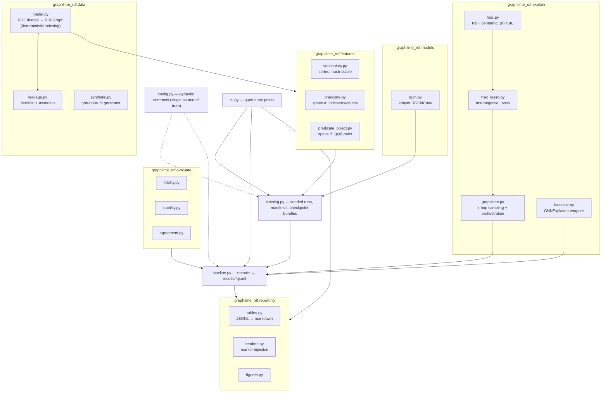

# Architecture

Module map and data flow for `graphlime-rdf`. The directory contract
(plan §5): `results/` holds validated records, tables and figures; `runs/`
holds the training audit trail; `checkpoints/` holds one best bundle per
dataset.

## Module map



## Data flow

```mermaid
flowchart LR
    dumps["benchmark dumps<br/>*_stripped.nt.gz + TSV"] --> loader2["loader<br/>+ leakage assert"]
    loader2 --> graph["RDFGraph"]
    graph --> fb["FeatureBuilder<br/>(space A / B)"]
    fb --> X["X: interpretable features"]
    X --> model2["R-GCN (input = X)"]
    model2 --> ckpt["checkpoints/*_best.pt<br/>(self-contained bundle)"]
    model2 --> Y["predicted probabilities"]
    X --> glime["GraphLIME<br/>HSIC Lasso on k-hop nodes"]
    Y --> glime
    glime --> recs["ExplanationRecords<br/>results/*.jsonl"]
    recs --> tab["tables.py → results/tables/*.md"]
    tab --> docs2["report/relazione.md<br/>(marker injection)"]
```

Key invariant: the model input and the explanation space share **one
vocabulary** (plan §6) — fidelity is column masking on `X`, and every feature
index maps back to a readable predicate name.
