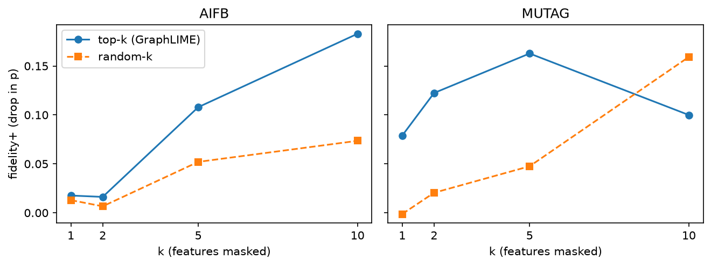
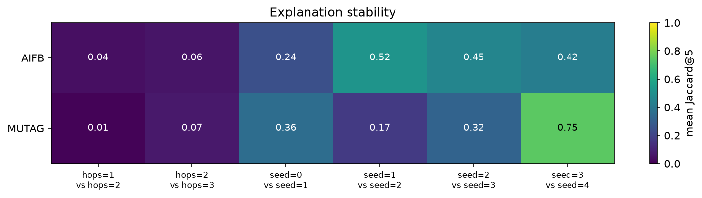
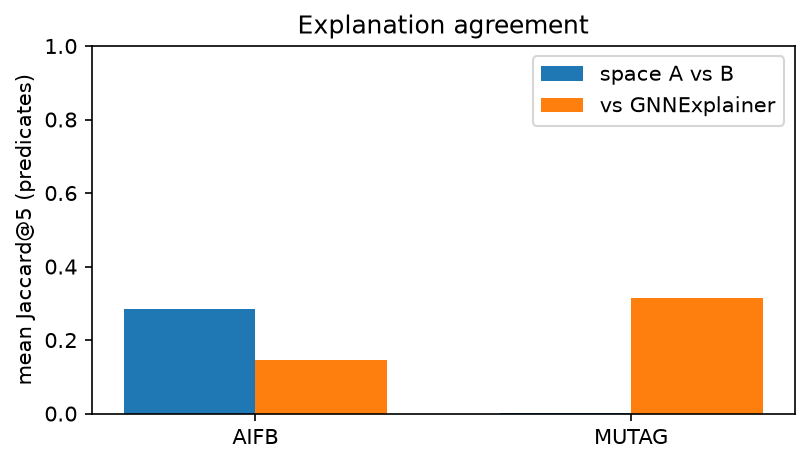

# GraphLIME on RDF knowledge graphs: explaining R-GCN entity classification in the vocabulary of the graph

*XAI laboratory course — project report.*
Code, data pipeline and all numbers: the `graphlime-rdf` repository. Every
table in this report is generated from `results/*.jsonl` by
`python -m graphlime_rdf.cli tables` and injected by `cli readme`; no number
is typed by hand.

## 1. Motivation

Relational Graph Convolutional Networks (R-GCN, Schlichtkrull et al., 2018)
are the standard baseline for entity classification on RDF knowledge graphs.
They are also opaque twice over: like any GNN their decision is buried in
message passing, and — specific to the RDF setting — their usual input is a
**one-hot entity id**, so even a perfect feature-attribution method could
only say "entity #4211 mattered", which explains nothing.

This project asks: *can we make the explanation speak RDF?* An explanation
for "person X belongs to research group Y" should be a statement like
"because X carries `swrc:publication` edges toward papers of that group" —
predicates and terms of the knowledge graph, not tensor indices.

## 2. The design decision

We replace the one-hot input with an **explicit interpretable feature
space** built from the graph itself (the methodological contribution of this
project):

- **Space A — predicate counts.** Feature `out:
` counts the node's
  outgoing `
` edges, `in:
` its incoming ones.
- **Space B — predicate–object pairs.** Feature `out:
=<o>` marks having
  `
` toward the specific term `<o>`, pruned below a support threshold.

The R-GCN consumes space A directly as its node feature matrix. Model and
explainer therefore share one vocabulary: any feature the explainer scores is
a readable statement about the graph, and fidelity can be measured by
masking feature columns of the actual model input. (Structural fidelity —
perturbing edges instead of features — is future work.)

## 3. Method

**GraphLIME** (Huang et al., 2020) explains one node's prediction by treating
its k-hop neighbours as local samples and selecting, with a non-negative
**HSIC Lasso** (Yamada et al., 2014), the features whose similarity structure
best explains the model outputs' similarity structure. HSIC — the
Hilbert–Schmidt Independence Criterion (Gretton et al., 2005) — is a
kernel-based dependence measure; unlike correlation it detects non-linear
dependence, which our property tests assert explicitly (`y = x²` with
Pearson ≈ 0 must yield clearly positive HSIC). Both HSIC and the solver are
implemented from scratch (`explain/hsic.py`, `explain/hsic_lasso.py`) with
hypothesis property tests written before the implementation: symmetry,
non-negativity, nHSIC ∈ [0,1], joint-permutation invariance, weight-splitting
for duplicated features, and sparsity monotone in the regularisation ρ.

Full derivations as implemented: `docs/method.md`.

**Baseline.** GNNExplainer (Ying et al., 2019), as shipped by PyG. Its edge
masks are structurally incompatible with `RGCNConv` (one propagate per
relation on edge subsets — the full-graph mask can never align; ADR-007), so
the baseline uses GNNExplainer's *attribute mask* over the same feature
matrix: it scores exactly the features GraphLIME scores, making rankings
directly comparable at the predicate level.

## 4. Experimental setup

**Datasets.** AIFB (8,285 nodes, 29,043 triples, 45 predicates, 4 classes —
research-group affiliation) and MUTAG (23,644 nodes, 74,227 triples, 23
predicates, 2 classes — mutagenicity), the standard R-GCN benchmark dumps,
parsed directly from the raw RDF with fully deterministic indexing (blank
nodes canonicalised; loader byte-identical across processes and
`PYTHONHASHSEED`). The label-revealing predicates (`employs`/`affiliation`
for AIFB, `isMutagenic` for MUTAG) are already stripped from the benchmark
dumps; an explicit blocklist **asserts** their absence at every load.

**Model.** Two-layer `RGCNConv` with basis decomposition (30 bases, hidden
32, dropout 0), full-batch Adam (lr 0.01, 200 epochs), predicate-count
features in both directions, 5 seeds, deterministic kernels. Chosen from a
small fixed grid (ADR-006); per-seed accuracies live in `runs/final/` and in
the tables below. For reference, the R-GCN paper reports 95.8% (AIFB) and
73.2% (MUTAG) with one-hot inputs.

**Explanations.** GraphLIME with 2-hop neighbourhoods (deterministically
subsampled above 200 nodes), RBF kernels with median-heuristic bandwidth,
ρ = 0.1. Neighbourhoods under 10 nodes are refused and counted. All test
nodes of each dataset are explained.

**Correctness gate.** Before any number below was produced, the synthetic
ground-truth gate (M6) had to pass: on a generated graph where class 1 ⟺
the entity has predicate p₇, GraphLIME ranked `out:syn:p7` **first** for
≥95% of explained nodes at 0% noise, and kept it top-3 under two distractor
predicates 90%-correlated with the target. It passed on the first run
(`just synthetic` reproduces it). The fidelity+ > random-k requirement is
likewise asserted on the synthetic graph only; on real data the numbers are
reported, not asserted.

## 5. Results

<!-- RESULTS:BEGIN -->
### Classification accuracy

| dataset | test accuracy (mean ± std, 5 seeds) | per-seed | best seed | best accuracy | checkpoint sha256 |
|---|---|---|---|---|---|
| AIFB | 0.8833 ± 0.0534 | 0.9167, 0.9444, 0.8056, 0.8889, 0.8611 | 1 | 0.9444 | `8f69360a52b0` |
| MUTAG | 0.7559 ± 0.0305 | 0.7794, 0.7206, 0.7353, 0.7500, 0.7941 | 4 | 0.7941 | `20de0d5614ec` |

### Explanation fidelity (column masking, random-k control)

| dataset | k | fidelity+ | random+ | fidelity− | random− | nodes |
|---|---|---|---|---|---|---|
| AIFB | 1 | 0.0176 | 0.0129 | 0.7145 | 0.6767 | 36 |
| AIFB | 2 | 0.0162 | 0.0066 | 0.7386 | 0.7556 | 36 |
| AIFB | 5 | 0.1079 | 0.0520 | 0.7160 | 0.6085 | 36 |
| AIFB | 10 | 0.1829 | 0.0735 | 0.6338 | 0.6184 | 36 |
| MUTAG | 1 | 0.0789 | -0.0013 | 0.5397 | 0.3151 | 68 |
| MUTAG | 2 | 0.1224 | 0.0205 | 0.3068 | 0.2744 | 68 |
| MUTAG | 5 | 0.1627 | 0.0475 | 0.1987 | 0.3352 | 68 |
| MUTAG | 10 | 0.0999 | 0.1592 | 0.2299 | 0.3462 | 68 |

### Explanation stability (Jaccard@5)

| dataset | comparison | pair | mean Jaccard@5 | pairs |
|---|---|---|---|---|
| AIFB | hops | hops=1 vs hops=2 | 0.0413 | 21 |
| AIFB | hops | hops=2 vs hops=3 | 0.0585 | 36 |
| AIFB | seeds | seed=0 vs seed=1 | 0.2443 | 36 |
| AIFB | seeds | seed=1 vs seed=2 | 0.5162 | 36 |
| AIFB | seeds | seed=2 vs seed=3 | 0.4547 | 36 |
| AIFB | seeds | seed=3 vs seed=4 | 0.4239 | 36 |
| MUTAG | hops | hops=1 vs hops=2 | 0.0103 | 68 |
| MUTAG | hops | hops=2 vs hops=3 | 0.0696 | 68 |
| MUTAG | seeds | seed=0 vs seed=1 | 0.3593 | 68 |
| MUTAG | seeds | seed=1 vs seed=2 | 0.1709 | 68 |
| MUTAG | seeds | seed=2 vs seed=3 | 0.3179 | 68 |
| MUTAG | seeds | seed=3 vs seed=4 | 0.7475 | 68 |

### Feature-space sensitivity and baseline agreement

| dataset | comparison | mean Jaccard@5 (predicates) | nodes |
|---|---|---|---|
| AIFB | GraphLIME: space A vs space B | 0.2843 | 36 |
| AIFB | GraphLIME vs GNNExplainer | 0.1456 | 36 |
| MUTAG | GraphLIME: space A vs space B | 0.0029 | 68 |
| MUTAG | GraphLIME vs GNNExplainer | 0.3153 | 68 |

### Refused explanations

| dataset | explained | refused | refusal rate | reasons |
|---|---|---|---|---|
| AIFB | 36 | 0 | 0.0000 | — |
| MUTAG | 68 | 0 | 0.0000 | — |

<!-- RESULTS:END -->

### Reading the results

- **Accuracy.** The interpretable feature space is not a handicap on MUTAG —
  the 5-seed mean *exceeds* the paper's one-hot R-GCN (0.732) — while AIFB
  lands several points below its 0.958: AIFB's classes hinge on *which*
  entity a person is connected to, exactly the information per-entity
  embeddings encode for free and predicate counts deliberately discard.
- **Fidelity.** For k ≤ 5, masking GraphLIME's top-k feature columns hurts
  the prediction clearly more than masking random-k on both datasets — the
  explanations point at features the model actually uses. At k = 10 on
  MUTAG the comparison inverts: explanations there typically have fewer than
  ten non-zero β, so the top-10 set pads with irrelevant columns while
  random-10 already covers a fifth of MUTAG's 46 columns. fidelity− stays
  high on AIFB at every k (≈ 0.7): no five features *suffice* — the model
  spreads evidence across the neighbourhood's feature profile. On MUTAG,
  keeping only the top-5 preserves the prediction markedly better than
  keeping random-5 (0.199 vs 0.335 drop).
- **Stability.** Across training seeds, explanations agree moderately
  (Jaccard@5 ranging ≈ 0.17–0.75) — different seeds reach similar accuracy
  through partially different feature use, which is precisely why the
  per-seed comparison is reported. Across hops, agreement is near zero: the
  1-hop and 2-hop neighbourhoods of an entity contain different node
  populations, and the local HSIC estimate follows the sample, not the
  target alone. Neighbourhood radius is the single most consequential
  explanation hyperparameter in this setting.
- **Feature-space sensitivity (A vs B) and baseline agreement** are reported
  at the predicate level. AIFB shows moderate A-vs-B overlap (0.28); MUTAG's
  is essentially zero — the pair-level space shifts weight onto specific
  `rdf:type` objects (atom types) that space A cannot express. Agreement
  with GNNExplainer's attribute mask is limited (0.15 / 0.32): the two
  methods answer related but different questions (kernel dependence vs
  learned mask), and the disagreement itself is a reported finding.
- **Refusals: none.** With 2-hop neighbourhoods every test entity of both
  datasets clears `min_neighborhood = 10` — the refusal machinery is
  exercised by the test suite and reported empty here.

## 6. Qualitative examples

The executed notebook (`notebooks/qualitative.ipynb`, rendered as
`qualitative.html`) loads the committed checkpoints and prints sentence-form
explanations for test entities of both datasets, e.g. a person *correctly
predicted* into a research group *because of* `publication` and `author`
edges toward the group's papers, or a MUTAG bond classified through its
atom-type context. Refusals are printed inline, not skipped.

## 7. Limitations

- **Local linearity of the HSIC Lasso ranking:** β weights are a local,
  kernel-level account of dependence, not causal effects.
- **Feature masking fidelity** measures necessity/sufficiency of *columns*,
  graph-wide; it does not perturb graph structure (see future work).
- **Neighbourhood subsampling** above 200 nodes trades a small amount of
  estimator variance for tractability (deterministic per node).
- **Two small benchmarks**; conclusions about the feature space are not
  claimed to transfer beyond RDF entity classification of this scale.
- The GNNExplainer comparison uses its attribute mask (ADR-007): agreement
  numbers compare feature attributions, not edge attributions.

## 8. Future work

- **GraphSHAP** as a second attribution method over the same vocabulary.
- **Structural fidelity** (edge-level perturbations respecting relation
  types) — cut from this run by design.
- Support-threshold sweeps for space B as a systematic sensitivity study.

## References

- Schlichtkrull et al., *Modeling Relational Data with Graph Convolutional
  Networks*, ESWC 2018.
- Huang et al., *GraphLIME: Local Interpretable Model Explanations for Graph
  Neural Networks*, 2020.
- Yamada et al., *High-Dimensional Feature Selection by Feature-Wise
  Kernelized Lasso*, Neural Computation 2014.
- Gretton et al., *Measuring Statistical Dependence with Hilbert-Schmidt
  Norms*, ALT 2005.
- Ying et al., *GNNExplainer: Generating Explanations for Graph Neural
  Networks*, NeurIPS 2019.
